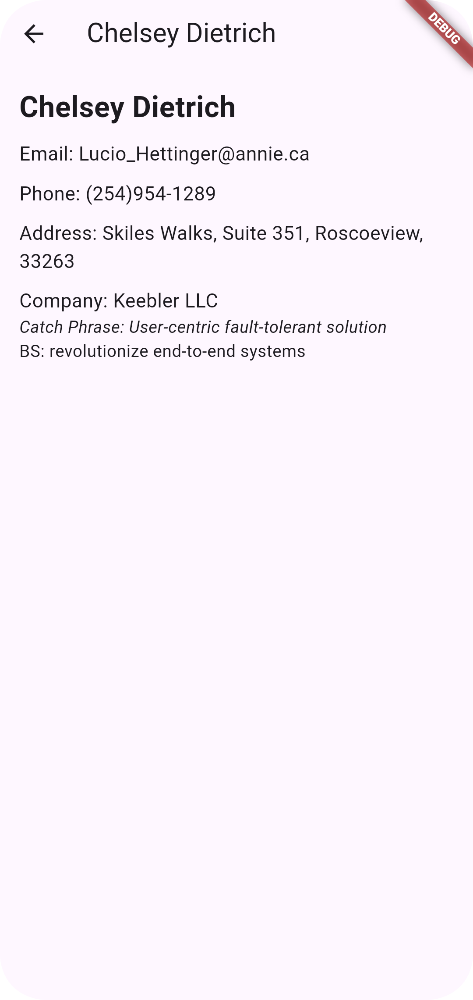

### Ömer Yavuz Ok 1030520715
### Erciyes Üniversitesi Bilgisayar Mühendisliği Mobile application Development Course Project
### Eğitim Görevlisi : Fehim KÖYLÜ

# mobile_application_devolopment
we pull a contact list using the https://jsonplaceholder.typicode.com api. when we click on any item in the list, we redirect to the detail screen.

##  App Screenshots

 

  
   &nbsp; &nbsp; &nbsp;
   

Uygulama listeleme ve detay ekranı olarak iki ekrandan oluşmakta. API ile verileri çekerken ve listeleme ekranına verileri aktarırken asenkron işlem yapılmakta. iki ekran arasındaki geçişlerde Hero animasyonlu geçiş uygulanmaktadır. Provider kütüphanesi ile state management gerçekleştirilmiştir.
 
 ## Library 🕹
- [Provider][1] - devtool friendly – using Provider, the state of your application will be visible in the Flutter devtool.
- [Http][2] - This package contains a set of high-level functions and classes that make it easy to consume HTTP resources. It's multi-platform (mobile, desktop, and browser) and supports multiple implementations.

[1]: https://pub.dev/packages/provider
[2]: https://pub.dev/packages/http
